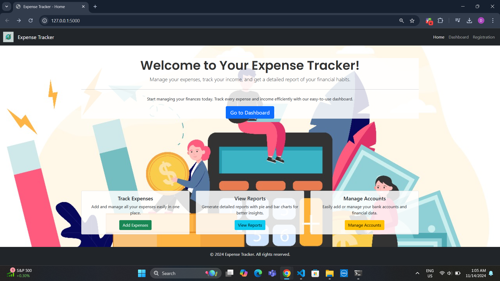
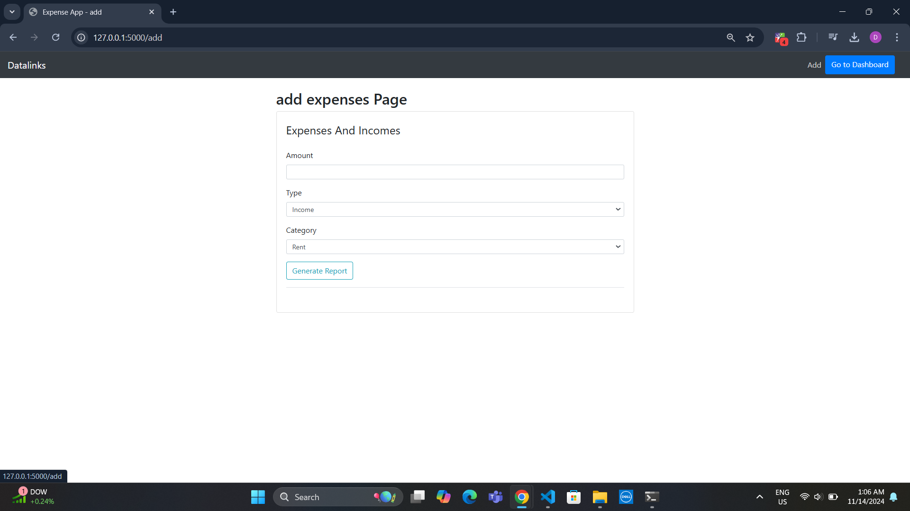
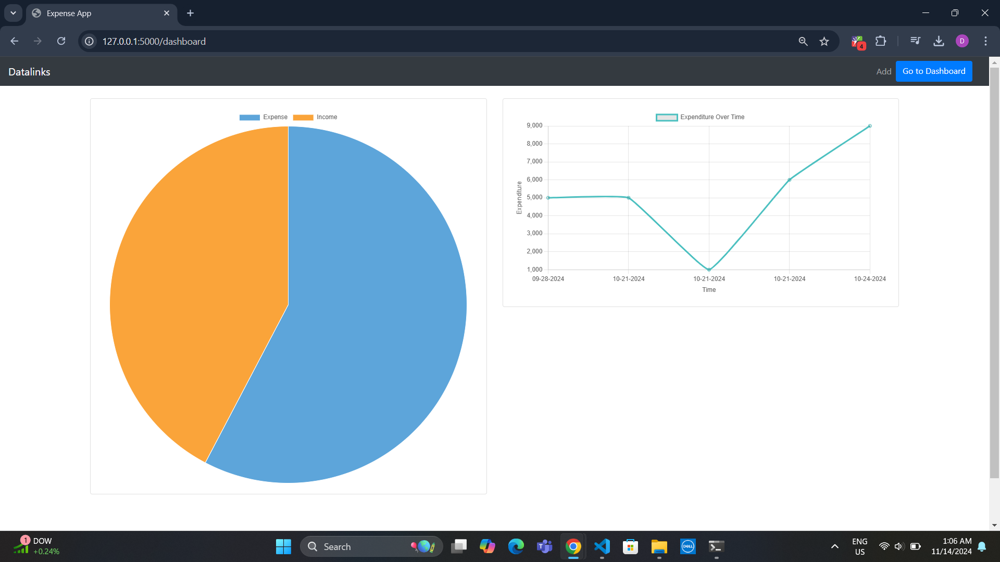
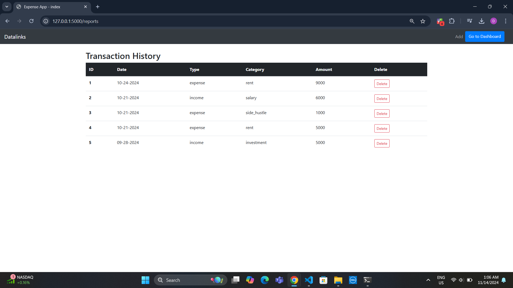

# 🧾 **Expense Tracker Web App**

This is a simple and intuitive **Expense Tracker Web Application** built using **Flask**, **MongoDB**, and **Bootstrap**. The app allows users to efficiently track their personal expenses, view detailed transaction history, and generate insightful reports through visual charts. Whether you're managing daily expenditures or analyzing monthly trends, this app provides a clear overview of your spending habits. 📊💸

## 🚀 **Features**

- **User Authentication** 🔒: Login/Signup functionality with session management using **Flask-Login**.
- **Add Expenses** 💰: Users can log their expenses with details like amount, category, and description.
- **Transaction History** 📝: View all past transactions in a table, making it easy to track every expense.
- **Expense Reports** 📊: Visualize your expenses with pie charts and bar graphs categorized by type.
- **Responsive UI** 📱: The app is fully responsive and built with **Bootstrap**, making it mobile-friendly.

## 🛠️ **Tech Stack**

- **Backend**: Python, Flask
- **Database**: MongoDB
- **Frontend**: HTML, CSS, Bootstrap
- **Libraries**: 
  - **Flask-Login** for user session management
  - **Matplotlib** for generating visual reports
  - **Plotly** for interactive graphs
- **Other Tools**: 
  - **Jinja2** templating engine for dynamic HTML pages
  - **Werkzeug** for handling user authentication

## 📦 **Installation**

To run this project locally, follow these steps:

1. Clone the repository:
   ```bash
   git clone https://github.com/your-username/expense-tracker.git
   ```

2. Navigate to the project directory:
   ```bash
   cd expense-tracker
   ```

3. Create a virtual environment:
   ```bash
   python -m venv venv
   ```

4. Activate the virtual environment:
   - **Windows**:
     ```bash
     .\venv\Scripts\activate
     ```
   - **Mac/Linux**:
     ```bash
     source venv/bin/activate
     ```

5. Install the required dependencies:
   ```bash
   pip install -r requirements.txt
   ```

6. Set up MongoDB (ensure MongoDB is running locally or use a cloud service like MongoDB Atlas).

7. Run the application:
   ```bash
   python app.py
   ```

8. Open your browser and visit `http://127.0.0.1:5000/` to access the app.

## 📸 **Screenshots**

Here’s a quick look at the app's key features:

### 1. **Login Page** 🔑


### 2. **Add Expense** 📝


### 3. **Reports (Pie Chart)** 📊


### 4. **Transaction History** 📃


## 📈 **How it Works**

- **User Authentication**: Users can create accounts and log in to securely access their personal expense data. The app uses Flask-Login to manage sessions and keep users authenticated.
- **Expense Logging**: After logging in, users can add new expenses, providing details such as amount, category, and description. This information is stored in a MongoDB database.
- **Transaction History**: The app displays a list of all recorded transactions, showing the expense category, amount, and description. This feature allows users to review past expenses and identify spending patterns.
- **Reports**: The app generates graphical reports (pie charts and bar graphs) that categorize and summarize expenses. This provides a clear, visual representation of where money is being spent.

## 🔧 **Technologies Used**

- **Flask**: Lightweight Python web framework used for building the backend of the app.
- **MongoDB**: NoSQL database used to store user data and transaction records.
- **Bootstrap**: Frontend framework for responsive, mobile-first design.
- **Matplotlib**: Python library for generating static, animated, and interactive visualizations like pie charts and bar graphs.
- **Plotly**: Interactive graphing library used to enhance the user experience with dynamic reports.
